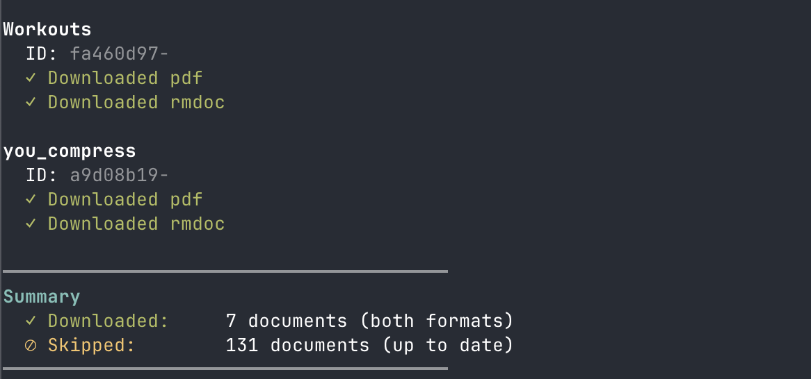

# reMarkable Sync

Sync files from your reMarkable tablet to your computer. Downloads both PDF and RMDOC formats, tracking changes to avoid re-downloading unchanged files.



## Build

```bash
go build -o remarkable-sync main.go
```

## Run

```bash
# Sync all notebooks
./remarkable-sync

# List available notebooks
./remarkable-sync list

# Download a specific notebook (full PDF)
./remarkable-sync "My Notebook"

# Download just the last page of a notebook
./remarkable-sync "My Notebook" last
```

The last-page file is saved to `downloads/pdf/{name}_page_{N}.pdf`.

## How It Works

- Fetches document list from `http://10.11.99.1/documents/`
- Compares timestamps with local manifest (`.sync_manifest.json`)
- Downloads only new or modified documents
- Saves files to `downloads/pdf/` and `downloads/rmdoc/`
- Retries failed downloads (3 attempts)
- Exits early if tablet becomes unreachable

## Requirements

- reMarkable tablet connected to the same network
- Go 1.16+ (install via `brew install go`)
- **Enable USB web interface on your reMarkable:**
  - Go to **Settings > Storage > USB web interface**
  - Toggle it ON
  - Your tablet should be accessible at `http://10.11.99.1`
